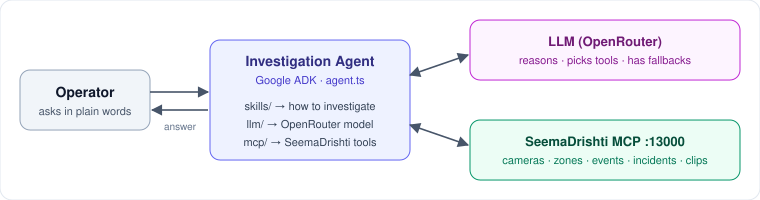

# agent

AI investigation assistant for SeemaDrishti. Operators ask questions in plain language, like *"why didn't the north fence alarm last night?"*. The agent looks up the answer through the SeemaDrishti MCP tools and replies with evidence (ids, times, cameras, zones).



## What it does
- Answers questions about **cameras, zones, events, incidents and clips**.
- Explains configuration ("why no alarm?"): placement, direction, confirm time, `log_only` targets.
- Converts relative times ("today", "last night") in `DISPLAY_TZ` to UTC and states the exact range it used.
- Never invents ids or counts. Every fact comes from a tool result.

## Tech stack
| Layer | Tech |
|---|---|
| Language | TypeScript (ESM), run with `tsx` |
| Agent framework | Google ADK (`@google/adk`, `@google/adk-devtools`) |
| LLM | OpenRouter, or any OpenAI-compatible Chat Completions API (default `anthropic/claude-sonnet-5`) |
| Tools | Model Context Protocol (`@modelcontextprotocol/sdk`) over streamable HTTP |
| Config | `dotenv` |

## Layout
| Path | Purpose |
|---|---|
| `agent.ts` | Root `LlmAgent` (Google ADK): wires the model, instructions and tools |
| `llm/openrouter.ts` | ADK model adapter for any OpenAI-compatible API, with retries and fallback models |
| `mcp/index.ts` | Connects to the SeemaDrishti MCP server over HTTP |
| `skills/instructions.ts` | System prompt: domain, tool guide, investigation steps, answer format |

## Run
```bash
cp .env.sample .env      # set LLM_API_KEY, LLM_MODEL_STRING, SEEMADRISHTI_MCP_URL
npm install
npm run web              # ADK dev UI  → http://localhost:3080
npm run api              # API server  → http://localhost:4080
```
Requires the SeemaDrishti MCP server at `SEEMADRISHTI_MCP_URL` (default `http://localhost:13000/mcp`).

## Config (`.env`)
| Var | Meaning |
|---|---|
| `LLM_API_KEY` / `LLM_MODEL_STRING` / `LLM_BASEURL` | Model provider (OpenRouter by default) |
| `LLM_FALLBACK_MODELS` | Comma-separated backup models for rate limits and outages |
| `SEEMADRISHTI_MCP_URL` | MCP endpoint |
| `IBVAP_ACTOR` | Optional actor sent as `x-ibvap-actor` (default `usr_operator`) |
| `DISPLAY_TZ` | Time zone for reading and showing times |
