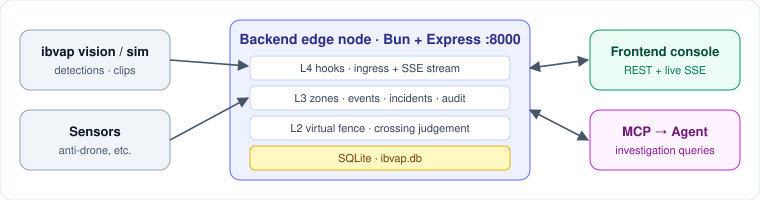
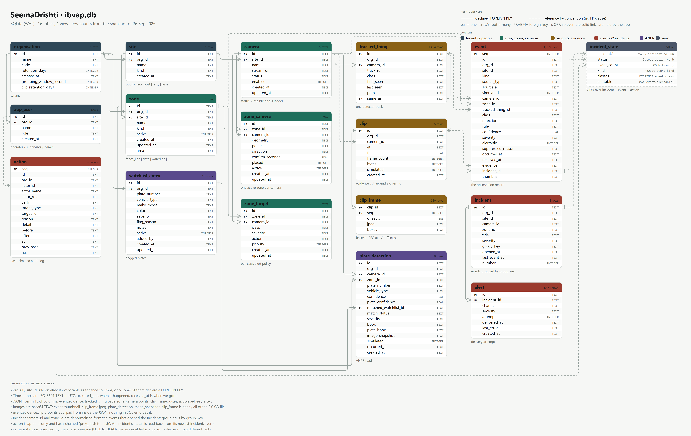

# backend

The SeemaDrishti edge node, running as one process per border post. It takes in detections, checks them against virtual-fence zones, turns real threats into incidents, records every operator decision, and serves all of this to the console and the MCP. It needs no cloud connection: everything runs on one local SQLite file.



## What it does
- **Virtual fence:** line and polygon zones that know crossing direction and wait `confirmSeconds` before raising an alarm.
- **Events and incidents:** an append-only event log, grouped into incidents and pushed live over SSE.
- **Audit:** a hash-chained record of who did what and why. Incident status is derived from this record.
- **Watchlists:** vehicle plates (ANPR) and people, plus a one-off target search and clip storage.

## Tech stack
| Layer | Tech |
|---|---|
| Runtime | Bun (TypeScript, ESM) |
| HTTP | Express 5 with CORS |
| Storage | SQLite (`bun:sqlite`), `ibvap.db` |
| Live push | Server-Sent Events (`/api/stream`) |
| Tests | `bun test` |

## Layout
| Path | Purpose |
|---|---|
| `src/l2/` | Fence geometry and crossing judgement |
| `src/l3/` | Zones, cameras, events, audit, watchlists, clips, settings |
| `src/l4/` | Ingress hooks, vision adapter, event bus |
| `src/routes/` | Express routers (`/api/*`, `/hooks/ingress/*`) |
| `src/db/` | Schema, migrations, first-boot seed |
| `src/sim/` | Scenario simulator (intruder, cattle, drone, …) |
| `test/` | Unit and route tests |

## Data model
[](../docs/er-diagram-hd.png)

Click to open full size (5940×3750). Vector version: [`er-diagram.svg`](../docs/er-diagram.svg).

## Run
```bash
bun install
bun run dev              # http://localhost:8000
bun test
```
On first boot it creates and seeds `ibvap.db`. To start fresh, delete `ibvap.db` and `ibvap.db-wal`. Addresses are read from the repo-root `.env`.

## Key routes
| Route | Meaning |
|---|---|
| `GET /api/config` · `/api/stream` | Setup snapshot · live SSE feed |
| `/api/zones` · `/api/cameras` | Zone and camera setup (writes need supervisor or above) |
| `/api/incidents` · `/api/events` · `/api/audit` | Incidents, event log, audit trail |
| `/api/watchlist` · `/api/clips` | Watchlists · stored evidence clips |
| `POST /hooks/ingress/*` | Entry point for detections, sensor alerts and clips |

The acting user comes from the `x-ibvap-actor` header, so no write is anonymous.
