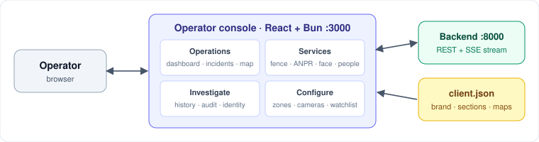

# frontend

The SeemaDrishti operator console. It's a React app that shows live detections, incidents and camera feeds on a map, and lets operators act on alerts and configure zones, cameras and watchlists. All data comes from the edge node in [`../backend`](../backend). One build serves many deployments: a `client.json` file sets the branding, the enabled sections and the maps for each one.



## What it does
- **Operations:** dashboard, incident queue (acknowledge, escalate or dismiss with a reason), live sector map.
- **Services:** one page per detection capability: fence, ANPR, face, people, camera health.
- **Investigate:** history search, audit trail, identity lookup.
- **Configure:** a zone wizard with a shape editor, cameras, watchlists, settings. Available sections depend on role (operator, supervisor, admin).

## Tech stack
| Layer | Tech |
|---|---|
| Runtime / bundler | Bun (dev server, hot reload, `build.ts`) |
| UI | React 19, React Router 7 |
| Styling | Tailwind CSS 4, shadcn/ui (Radix), lucide icons |
| State | Zustand |
| Maps | Leaflet + react-leaflet |
| Live data | SSE from the backend `/api/stream` |

## Layout
| Path | Purpose |
|---|---|
| `src/app/` | Shell, header, sidebar |
| `src/features/` | One folder per screen; `registry.tsx` lists every section |
| `src/components/ibvap/` | Domain widgets: maps, feeds, clip player, tables |
| `src/components/ui/` | shadcn primitives |
| `src/client/` | `client.json` loader, deployment profiles, console store |
| `src/lib/` | API client, SSE stream, types, formatting |
| `client*.json` | Per-deployment config (default, Navy and Bhuvan examples) |

## Run
```bash
bun install
bun run dev              # http://localhost:3000
bun test
bun run build            # static bundle → dist/
```
To use another deployment's config, set `IBVAP_CLIENT_CONFIG=./client.navy.example.json`. The backend must be running at `apiBase` (default `http://localhost:8000`). For design rules, see [`../docs/UI_GUIDELINES.md`](../docs/UI_GUIDELINES.md).
