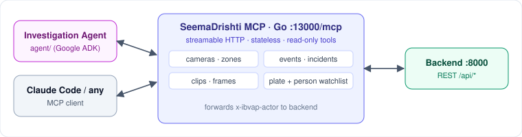

# mcp

The SeemaDrishti MCP server, written in Go. It exposes the backend's data (cameras, zones, events, incidents, clips and watchlists) as [Model Context Protocol](https://modelcontextprotocol.io) tools, so an AI agent can investigate the system. The [`../agent`](../agent) uses it, and so can Claude Code or any other MCP client.



## What it does
- Serves 21 **read-only** tools over streamable HTTP at `:13000/mcp`. The server keeps no session state.
- Each tool call becomes a backend REST request (`/api/*`) and returns JSON.
- Forwards the caller's `x-ibvap-actor` header, so the backend knows who is asking.
- Logs every tool call with its timing.

## Tech stack
| Layer | Tech |
|---|---|
| Language | Go 1.26 |
| MCP | `mark3labs/mcp-go` (streamable HTTP server) |
| Backend client | `net/http` → SeemaDrishti backend REST |

## Layout
| Path | Purpose |
|---|---|
| `main.go` | Server setup, tool registration, logging middleware |
| `internals/backend/` | HTTP client for the backend, with actor pass-through |
| `internals/tools/` | One file per entity: `camera`, `zone`, `events`, `incident`, `clip`, `watchlist`, `person` |
| `learning/` | Scratch example, not part of the server |
| `binaries/` | Built `.exe` files (gitignored) |

## Tools
| Area | Tools |
|---|---|
| Cameras | `list_cameras`, `get_camera`, `get_camera_incidents`, `list_media_cameras` |
| Zones | `list_zones`, `get_zone`, `get_zone_camera`, `get_zone_targets` |
| Activity | `list_events`, `list_incidents`, `get_incident` |
| Evidence | `get_clip`, `get_clip_frame`, `get_clip_usage` |
| Watchlists | `list_watchlist`, `get_watchlist_entry`, `get_watchlist_stats`, `list_plate_detections`, `get_vehicle_traffic`, `list_person_watchlist`, `get_person_watchlist_entry` |

## Run
```bash
go mod tidy
go run .                                   # listens on :13000
go build -o binaries/sd-mcp.exe .
claude mcp add --transport http seemadrishti http://localhost:13000/mcp
```
Env vars: `BACKEND_URL` (default `http://localhost:8000`) and `MCP_ADDR` (default `:13000`).
