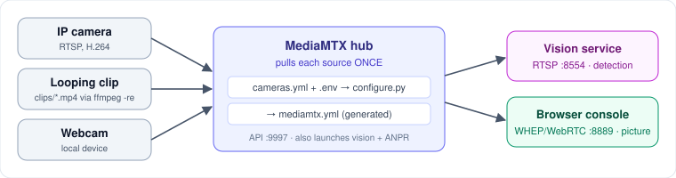

# media

The SeemaDrishti media plane. A single MediaMTX hub pulls each video source once (IP camera, looping clip or webcam) and serves it to every reader. The [vision service](../vision-service) reads over RTSP and the browser console over WHEP (WebRTC). The rest of the system never knows whether a path is fed by a clip or a real camera, so swapping one for the other is a config change, never a code change.



## What it does
- **One puller, many readers:** cheap IP cameras manage only 2–4 RTSP sessions, so neither the browser nor the detector connects to the camera directly.
- **Browser video:** browsers can't play RTSP, and WHEP (WebRTC) is the only transport fast enough for a live security screen.
- **Generated config:** `configure.py` turns `cameras.yml` + `.env` into `mediamtx.yml`. It also has the hub launch the vision service and the ANPR API.
- **Footage prep:** `fetch.py` downloads, trims and re-encodes clips to WebRTC-safe H.264, or generates synthetic test patterns.

## Tech stack
| Layer | Tech |
|---|---|
| Media hub | MediaMTX (`bin/mediamtx.exe`) |
| Protocols | RTSP `:8554` (workers), WHEP/WebRTC `:8889` (browser), control API `:9997` |
| Encoding | FFmpeg / ffprobe (H.264 Constrained Baseline, no B-frames) |
| Scripts | Python 3.11 (`configure.py`, `fetch.py`), PyYAML |
| Downloads | yt-dlp (optional, for `--url`) |

## Layout
| Path | Purpose |
|---|---|
| `cameras.yml` | **What cameras exist.** Shared, committed. To add a camera, add a block here |
| `configure.py` | `cameras.yml` + `.env` → `mediamtx.yml`. Run it after editing either one |
| `fetch.py` | Resolves clip sources: download, trim, re-encode to H.264 |
| `mediamtx.yml` | Generated, so don't edit it (gitignored) |
| `bin/` | Hub binary (gitignored; each machine fetches its own) |
| `clips/` | Footage (gitignored; licence terms vary per source) |
| `recordings/` | Empty; nothing in `configure.py` or `cameras.yml` writes here yet |

The root `.env` says **where modules run**, and `cameras.yml` says **what cameras exist**. Keeping them separate lets every machine read the same manifest while setting its own `IBVAP_WORKER_CAMERAS`.

## How video flows

```
source ──RTSP──> MediaMTX ──┬──RTSP──> vision service   (detection)
                             └──WHEP──> browser          (the picture)
```

## Run
```powershell
# once
Copy-Item .env.example .env

# clips: drop your own .mp4 into media/clips/ and point cameras.yml at it,
# or give a camera a url and let fetch.py do it
python media\fetch.py --camera cam_fence_north --url "https://..."

# no footage yet, just prove the plumbing
python media\fetch.py --synthetic

python media\configure.py
media\bin\mediamtx.exe media\mediamtx.yml
```

Check it:
```powershell
curl http://127.0.0.1:9997/v3/paths/list     # every path, ready=true
ffplay rtsp://127.0.0.1:8554/cam_fence_north # what a worker sees
```


## Adding a camera

Add one block to `cameras.yml`, then run `python media/configure.py`:

```yaml
  - id: cam_new_post          # must match a camera row in backend/src/db/seed.ts
    label: BOP-05 New Post
    detect: true
    source:
      kind: file              # file | rtsp | webcam
      path: clips/new_post.mp4
```

A typo in `id` shows up as a worker that runs fine but produces no events, because the backend rejects frames for an unknown `camera_id`. For the full walkthrough, see [`../docs/ADDING_A_CAMERA.md`](../docs/ADDING_A_CAMERA.md).
