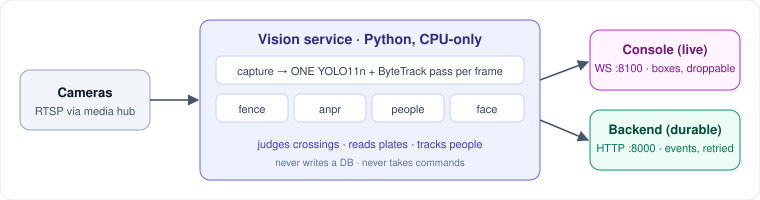

# vision-service

The SeemaDrishti vision pipeline (L1). It turns camera video into observations. Each frame gets one YOLO11n + ByteTrack pass, and several modules read that pass: virtual fence, ANPR, people tracking and face detection. It runs CPU-only on commodity hardware and never writes a database: it reports facts, and the [backend](../backend) decides what they mean.

> **The vision service owns realtime observation. The edge node owns durable truth and operator decisions.** That sentence decides where any piece of logic belongs.



## What it does
- **Fence:** judges zone intrusion and line crossing by direction. A crossing must hold for both N frames and N seconds before it counts.
- **ANPR:** runs OCR only on the plate area of an already-tracked vehicle, which cuts compute and false reads.
- **People and face:** tracks people within one camera (colour-based re-ID) and detects faces with YuNet (detection only, no recognition).
- **Two outputs:** live boxes to the console over WebSocket (can be dropped) and confirmed events to the backend over HTTP (retried, never lost).

## Tech stack
| Layer | Tech |
|---|---|
| Language | Python 3.11, asyncio + threads |
| Detection / tracking | Ultralytics YOLO11n, ByteTrack (`bytetrack.yaml`) |
| Vision / OCR | OpenCV (YuNet face), EasyOCR |
| Live channel | `websockets` (`:8100`) |
| Local APIs | FastAPI + Uvicorn (ANPR `:8001`, people `:8002`) |
| Tests | pytest |

## Layout
| Path | Purpose |
|---|---|
| `main.py` | Entry point: capture → shared pass → modules → both outputs |
| `config.py` | Reads `.env`, `media/cameras.yml`, and zones from the backend |
| `core/` | Capture, shared detector, geometry, payloads, dispatcher, clips, thumbnails |
| `modules/` | `fence`, `anpr`, `multi_human`, `reid`, `face` + watchlist/target clients |
| `ai_service.py` | Plate-scanner API for the console (`:8001`) |
| `people_ai_service.py` | People tracking + face API (`:8002`) |
| `debug_view.py` | Local file test harness; no media hub or backend needed |
| `tests/` | Pure-logic tests; no model, camera or network needed |

## How a frame flows

```
RTSP ─> capture ─> ONE YOLO11n + ByteTrack pass ─> fence ─────────┐
        latest-    per camera, shared by           anpr           ├─> LiveObservation
        frame-wins every module                    multi_human    │   WS :8100 → console
                                                   face ──────────┤   ephemeral, droppable
                                                                  │
                                                                  └─> DurableEvent
                                                                      HTTP :8000 → edge node
                                                                      confirmed, retried
```

This service **does** judge fence geometry, because a crossing has to be judged against the frame it happened in, at the rate frames arrive. It does **not** decide what a crossing *means*. Severity, and whether anyone gets woken up, come from the zone's targets, which a supervisor edits on the console and the backend stores and audits. What goes over the wire is a fact, like *"person crossed zone_3 inbound, held 1.4 s"*, and the backend applies the policy.

It never writes a database, never learns that an operator acknowledged anything, and never receives a command.

## Two contracts, not one payload with two destinations

| | Live (WebSocket) | Durable (HTTP) |
|---|---|---|
| Carries | boxes, tracks, unconfirmed guesses | confirmed intrusions, accepted plate reads, camera health |
| Rate | every processed frame | seconds to minutes apart |
| Slow consumer | **dropped** (latest wins) | **queued, retried with backoff, drained on exit** |
| Stored | never | always, by the backend |
| Authoritative | no | yes |

Suppose a confirmed intrusion went to the browser *and* the backend in parallel. A slow console or a failed POST would then cause three problems:
- alerts visible live but missing from history,
- duplicates on reconnect,
- operator decisions taken against events that were never saved.

Keeping two separate contracts rules this out by design: **nothing durable exists only in a browser.** The durable queue holds up to 512 events; beyond that it drops the newest and reports the count in the run summary.

## Modules

There is one shared detection pass per frame, and every active module reads its output. A module that runs its own detector goes against the design.

| Module | Does | Durable event |
|---|---|---|
| `fence` | polygon intrusion + line crossing, debounce, per-direction cooldown | `intrusion` |
| `anpr` | plate crop → OCR inside a tracked vehicle box | `plate_read` |
| `multi_human` | within-camera person tracking; folds reappearing tracks into one `person_id` | `reidentification` |
| `face` | cascaded YuNet inside a tracked person's box | none (live only, detection only) |

Which modules run is set per camera in `media/cameras.yml`:

```yaml
defaults:
  modules: [fence, multi_human]            # cheap: arithmetic over the shared pass

cameras:
  - id: cam_farm_gate
    modules: [fence, anpr, multi_human]    # ANPR is opt-in — it loads EasyOCR
  - id: cam_waterline
    modules:                               # mapping form takes params
      fence: { confirm_frames: 4, cooldown_seconds: 30 }
```

**Adding a module:** add a new file in `modules/` with `@register`, then add its name to the manifest. The dispatcher, the WebSocket server and the HTTP sink stay unchanged. That's the test of whether this layer is really pluggable.

## Configuration: three sources, deliberately not merged

| Source | Answers | Lifetime |
|---|---|---|
| `../media/cameras.yml` | **what** cameras exist, and which modules each runs | committed |
| `../.env` | **where** modules run, and what **this** box does | per-machine, gitignored |
| backend `/api/config` | **zones**, as the operator has drawn them | live, re-read every `IBVAP_ZONE_REFRESH_SECONDS` |

Zones are never written here. An operator draws them and the backend stores them, so an edit reaches the detector within one refresh interval, with no file change and no restart. There are two cases where the service still judges a crossing on an unconfirmed shape. In both, the event carries a label and the backend records the crossing without raising an alert:
- **`provisional`**: a camera was added to a zone but nobody has drawn its shape yet.
- **`stale`**: the backend was unreachable at startup, so zones came from the last-good cache (`.zone-cache.json`).

| Variable | Default | Meaning |
|---|---|---|
| `IBVAP_WORKER_CAMERAS` | `all` | Which cameras *this* machine runs detection on |
| `IBVAP_MEDIA_HOST` / `IBVAP_RTSP_PORT` | `127.0.0.1` / `8554` | Media hub address |
| `IBVAP_BACKEND_HOST` / `IBVAP_BACKEND_PORT` | `127.0.0.1` / `8000` | Backend address |
| `IBVAP_BOXES_BIND` / `IBVAP_BOXES_PORT` | `0.0.0.0` / `8100` | Where the console reads live observations |
| `IBVAP_WEIGHTS` / `IBVAP_FACE_MODEL` | `yolo11n.pt` / `data/face_detection_yunet_2023mar.onnx` | Detector and YuNet weights |
| `IBVAP_IMGSZ` / `IBVAP_CONF` | `480` / `0.35` | Inference size, confidence floor |
| `IBVAP_TARGET_FPS` | `6` | Processed frames per second, per camera |

Every machine reads the same manifest but sets its own `IBVAP_WORKER_CAMERAS`. That's how one worker per laptop works.


## Run
```powershell
python -m pip install -r requirements.txt   # separate from `bun run setup`
python main.py                              # cameras from IBVAP_WORKER_CAMERAS
python main.py --cameras cam_farm_gate
python main.py --no-backend                 # live channel only, nothing recorded
python main.py --seconds 60                 # comparable baseline row per laptop
python main.py --imgsz 384 --target-fps 4   # tuning: imgsz first, then fps
.\run-anpr.ps1                              # plate scanner API on :8001
.\run-people-ai.ps1                         # people/face API on :8002
python -m pip install -r requirements-dev.txt; python -m pytest tests/
```

Full system, with three terminals from the repo root:
```powershell
media\bin\mediamtx.exe media\mediamtx.yml   # 1 — media hub (see media/README.md)
bun run dev                                  # 2 — backend + console
python vision-service\main.py                # 3 — vision service
```

